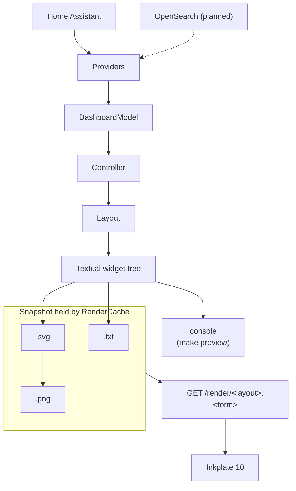

# inkdash guide

Everything beyond getting the dashboard on screen. Start with [README.md](README.md) for
requirements and a quick start; [firmware/SETUP.md](firmware/SETUP.md) covers flashing the
panel, the captive portal and every device setting.

- [Connecting Home Assistant](#connecting-home-assistant)
- [The HTTP API](#the-http-api)
- [The Inkplate](#the-inkplate)
  - [Changing device settings](#changing-device-settings)
- [Running it in Docker](#running-it-in-docker)
- [Everyday development](#everyday-development)
- [Architecture](#architecture)
- [Displays](#displays)
- [Adding dependencies](#adding-dependencies)

## Connecting Home Assistant

The REST API accepts bearer tokens only. Create a long-lived access token under your Home
Assistant profile (Security tab, bottom of the page) and put it in `.env`:

```bash
cp .env.example .env          # then fill in HA_URL and HA_TOKEN
cp config/config.example.yaml config/config.yaml

make ha-check                 # verifies the connection and lists candidate entity ids
```

`.env` is read automatically by the CLI, the server and `docker compose` alike, so there is
no `source .env` step. Variables already set in the shell win over the file, which is how a
deployment injects its own credentials: `HA_TOKEN=... uv run inkdash serve`.

`$HA_URL` overrides `home_assistant.url` in `config/config.yaml`, and `$HA_TOKEN` is the
only place a token belongs. Leaving `HA_URL` unset falls back to the configured URL, so a
committed config can name the usual instance while a deployment points elsewhere.

```bash
uv run inkdash ha-check --dump-fixture tests/fixtures/ha/states.json
```

## The HTTP API

```bash
make serve                  # GET http://localhost:10825/render/home.png
make serve PORT=9000        # any port, any host with HOST=
```

| Endpoint | Answers |
| --- | --- |
| `GET /render/<layout>.<png\|svg\|txt>` | The dashboard, from the most recent render |
| `GET /layouts` | The registered layout names |
| `GET /health` | Liveness, plus whether a dashboard exists yet |

The server renders in the background on a timer and every request is answered from the last
result, so a request is a memory read rather than a Home Assistant fan-out and a
rasterization. A request that arrives before anything has been rendered builds the snapshot
itself rather than being turned away, so a restart costs the first caller one render and
nobody else. `/render` only answers `503` when there is no snapshot *and* rendering one just
failed.

## The Inkplate

Build and flash the firmware with the board connected over USB:

```bash
make firmware-build
make firmware-flash
```

The default build targets a Soldered Inkplate 10. An older e-radionica board needs
`ENV=inkplate10`; [firmware/SETUP.md](firmware/SETUP.md) explains how to tell them apart,
and covers flashing, the portal and every setting.

### Changing device settings

From the Home Assistant UI, the entities are on the device page under Settings → Devices.
The same thing as an action, for automations:

```yaml
action: mqtt.publish
data:
  topic: inkdash/inkdash/config/wakeup_every_seconds/set
  payload: "300"
  retain: true
```

```yaml
action: number.set_value
target:
  entity_id: number.inkdash_wakeup_every
data:
  value: 300
```

With curl, through the same Home Assistant service:

```bash
curl -sS -X POST \
  -H "Authorization: Bearer $HA_TOKEN" \
  -H "Content-Type: application/json" \
  -d '{"topic":"inkdash/inkdash/config/wakeup_every_seconds/set","payload":"300","retain":true}' \
  "$HA_URL/api/services/mqtt/publish"

curl -sS -X POST \
  -H "Authorization: Bearer $HA_TOKEN" \
  -H "Content-Type: application/json" \
  -d '{"topic":"inkdash/inkdash/config/image_url/set","payload":"http://zimaboard.lan:10825/render/home.png","retain":true}' \
  "$HA_URL/api/services/mqtt/publish"
```

Or on the broker directly, with no Home Assistant involved:

```bash
mosquitto_pub -h zimaboard.lan -r \
  -t inkdash/inkdash/config/wakeup_every_seconds/set -m 300

mosquitto_pub -h zimaboard.lan -r \
  -t inkdash/inkdash/config/image_url/set \
  -m 'http://zimaboard.lan:10825/render/home.png'

mosquitto_sub -h zimaboard.lan -C 1 \
  -t inkdash/inkdash/config/wakeup_every_seconds/state
```

## Running it in Docker

```bash
make docker-build
make docker-up                # http://localhost:10825/render/home.png
make docker-down
```

Everything Docker-related lives in [docker/](docker/).

## Architecture



The boundaries that matter:

- A layout never queries a data source; it only reads a `DashboardModel`.
- A provider never imports Textual.
- The Inkplate is a display appliance. All layout logic lives on the server, so changing
  the dashboard never requires reflashing the device.
- Rendering is off the request path. A background task renders on
  `dashboard.render_interval_seconds` and the API serves its last result, so the panel's
  radio is on for a memory read rather than for a Home Assistant fan-out and a
  rasterization, and a cycle that fails keeps serving the dashboard already on the panel.
  Only a cold cache renders inside a request, and a lock means concurrent callers share
  that one render instead of each starting their own.
- One data load becomes one snapshot, and a snapshot carries every form at once. The
  `.txt`, `.svg` and `.png` of a layout are three renderings of the same instant, never
  three renders that happened to run close together.
