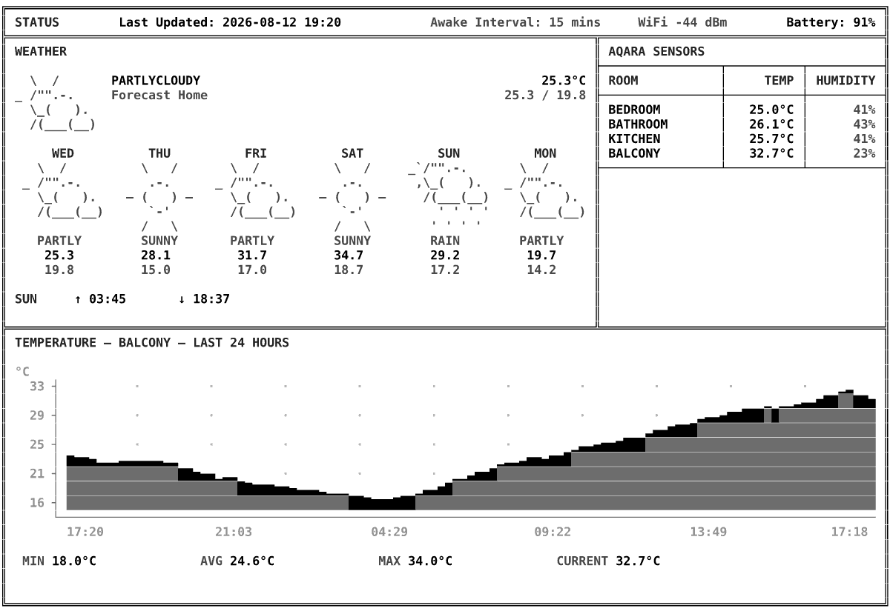

# inkdash

A server-rendered dashboard for an [Inkplate 10](https://soldered.com/product/inkplate-10-9-7-e-paper-board-copy/)
e-paper display, drawn in a terminal visual language with [Textual](https://textual.textualize.io/)
rather than a headless browser.

The renderer pulls data from Home Assistant, normalizes it into a model, and draws it once
into a Textual screen. That single widget tree feeds every output, so the terminal preview,
the SVG and the 1200x825 e-paper image can never drift apart.

### Example



```bash
╔══════════════════════════════════════════════════════════════════════════════════════════════════════════════════════╗
║ STATUS        Last Updated: 2026-08-12 19:22            Awake Interval: 15 mins     WiFi -44 dBm        Battery: 91% ║
╠═══════════════════════════════════════════════════════════════════════════════╦══════════════════════════════════════╣
║ WEATHER                                                                       ║ AQARA SENSORS                        ║
║                                                                               ╟────────────────┬──────────┬──────────╢
║   \  /       PARTLYCLOUDY                                              25.3°C ║ ROOM           │     TEMP │ HUMIDITY ║
║ _ /"".-.     Forecast Home                                        25.3 / 19.8 ╟────────────────┼──────────┼──────────╢
║   \_(   ).                                                                    ║ BEDROOM        │   25.0°C │      41% ║
║   /(___(__)                                                                   ║ BATHROOM       │   26.1°C │      43% ║
║                                                                               ║ KITCHEN        │   25.7°C │      41% ║
║      WED          THU          FRI          SAT          SUN          MON     ║ BALCONY        │   32.7°C │      23% ║
║    \  /          \   /       \  /          \   /     _`/"".-.       \  /      ╟────────────────┴──────────┴──────────╢
║  _ /"".-.         .-.      _ /"".-.         .-.       ,\_(   ).   _ /"".-.    ║                                      ║
║    \_(   ).    ― (   ) ―     \_(   ).    ― (   ) ―     /(___(__)    \_(   ).  ║                                      ║
║    /(___(__)      `-'        /(___(__)      `-'          ' ' ' '    /(___(__) ║                                      ║
║                  /   \                     /   \        ' ' ' '               ║                                      ║
║    PARTLY        SUNNY       PARTLY        SUNNY        RAIN        PARTLY    ║                                      ║
║     25.3         28.1         31.7         34.7         29.2         19.7     ║                                      ║
║     19.8         15.0         17.0         18.7         17.2         14.2     ║                                      ║
║                                                                               ║                                      ║
║ SUN     ↑ 03:45       ↓ 18:37                                                 ║                                      ║
║                                                                               ║                                      ║
╠═══════════════════════════════════════════════════════════════════════════════╩══════════════════════════════════════╣
║ TEMPERATURE — BALCONY — LAST 24 HOURS                                                                                ║
║                                                                                                                      ║
║ °C                                                                                                                   ║
║   33 ┤          ·         ·         ·         ·         ·         ·         ·         ·         ·         ·    ▁▂    ║
║      │                                                                                               ▁ ▁▁▂▃▃▅▇▇██▇▇▅ ║
║   29 ┤          ·         ·         ·         ·         ·         ·         ·         ·     ▂▃▃▄▆▆██████████████████ ║
║      │                                                                               ▂▄▄▆▇▇█████████████████████████ ║
║   25 ┤          ·         ·         ·         ·         ·         ·        ▁▃▃▄▅▅▆██████████████████████████████████ ║
║      │ ▆▅▅▄▂▂▂▃▃▃▃▃▃▂▂                                           ▁▂▂▃▅▅▄▆▆██████████████████████████████████████████ ║
║   21 ┤ ███████████████▇▇▅▄▄▁▂▂      ·         ·         ·  ▁▁▃▅▅▇███████████████████████████████████████████████████ ║
║      │ ████████████████████████▇▆▆▆▅▅▄▃▃▃▂▁▁▁         ▁▃▃▅▇█████████████████████████████████████████████████████████ ║
║   16 ┤ ████████████████████████████████████████▇▆▆▆▇████████████████████████████████████████████████████████████████ ║
║      └────────────────────────────────────────────────────────────────────────────────────────────────────────────── ║
║        17:22               21:03                04:29                 09:22                13:49              17:18  ║
║                                                                                                                      ║
║  MIN 18.0°C              AVG 24.6°C              MAX 34.0°C              CURRENT 32.7°C                              ║
║                                                                                                                      ║
║                                                                                                                      ║
╚══════════════════════════════════════════════════════════════════════════════════════════════════════════════════════╝
```

## Requirements

- [uv](https://docs.astral.sh/uv/)
- GNU Make

Everything else, including Python itself, is installed by `make bootstrap`. Building the
Inkplate firmware additionally needs PlatformIO, installed separately with
`uv tool install platformio`.

## Quick start

```bash
git clone https://github.com/Mmuzaf/inkdash.git
cd inkdash

make bootstrap
make preview-mock
```

```bash
make render-png       # build/dashboard.png, 1200x825, 8 grayscale levels
make validate-image   # verify it against the panel's constraints
make serve            # GET http://localhost:10825/render/home.png
make check            # everything CI runs
make help             # every target
```

### Home Assistant

```bash
make ha-check       # verify Home Assistant is reachable and fetch sensors data
```

```bash
curl -sS http://localhost:10825/render/home.txt
curl -sS -o /tmp/home.png http://localhost:10825/render/home.png && open /tmp/home.png
```

### Firmware

```bash
make firmware-build   # build/inkplate-firmware.bin
make firmware-flash   # flash the Inkplate over USB
make firmware-erase   # erase the Inkplate flash over USB
```

## Documentation

[GUIDE.md](GUIDE.md) covers the rest: connecting Home Assistant, the HTTP API, the Inkplate
firmware, Docker and CasaOS, everyday development, the architecture and its boundaries,
supported displays and their constraints, and adding dependencies.

[firmware/SETUP.md](firmware/SETUP.md) covers flashing the panel, the captive portal and
every device setting.

## References

- [GitHub: OpenSearch Component for Home-Assistant](https://github.com/driehuis/homeassistant-monitoring)
- [GitHub: Homeplate](https://github.com/lanrat/homeplate)


## ToDo List

Working today: the uv/Make tooling, the mock and Home Assistant providers, the pluggable
layouts, console/SVG/PNG rendering behind an HTTP API, and the Inkplate firmware with its
config portal, MQTT telemetry and deep sleep.

Still to come:

- [ ] **HTTPS for the image download.** Plain HTTP is fine on a trusted LAN and wrong off
      one. Needs `WiFiClientSecure` and a CA bundle in NVS, plus an answer for an expired
      certificate on a device that wakes every fifteen minutes.
- [ ] **Over-the-air firmware updates.** So a fleet of one does not need a USB cable.
- [ ] **Changing device settings from Home Assistant, without reflashing.** Every portal
      setting already lives in NVS, so this needs a way in rather than a new binary: a
      retained MQTT command topic, read on wake. Needs a fallback for a bad image URL
      arriving that way, which would leave the panel nothing to fetch and no portal open.
- [ ] **One source of truth for `sleep_minutes`.** Set in the portal, repeated in
      `config/config.yaml`, and the header counts down using the server's copy. Worth
      accepting from the environment and Home Assistant too, but only the device knows the
      interval it actually sleeps for, so it should report its own and the server prefer it.
- [ ] **An OpenSearch provider** for historical analytics alongside Home Assistant.
