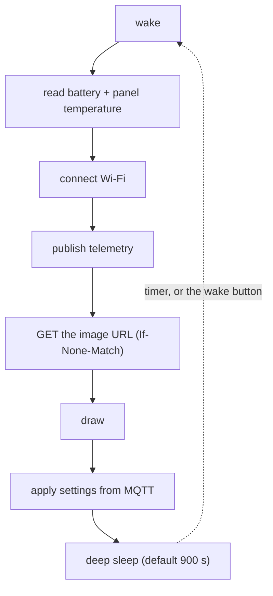

# Inkplate 10 firmware

The device is a display appliance. It wakes, reports telemetry over MQTT, downloads a PNG
from the renderer and goes back to sleep. All dashboard logic lives on the server, so
changing a layout never requires reflashing.



Nothing is retried in a loop. A failed cycle sleeps and tries again, and e-paper holds its
last frame without power, so a failed refresh never clears the display.

## Requirements

- [PlatformIO Core](https://docs.platformio.org/en/latest/core/installation/)
- A USB cable and an Inkplate 10

Install PlatformIO with the same tool the rest of the project uses:

```bash
uv tool install platformio
```

That puts `pio` on the PATH without touching the project's virtual environment, which
deliberately contains only the renderer's dependencies.

The platform, the Inkplate library and every dependency are pinned in
[platformio.ini](platformio.ini) and installed on the first build.

## Build and flash

Connect the Inkplate over USB and run, from the repository root:

```bash
make firmware-build
make firmware-flash
make firmware-monitor
make firmware-devices
```

PlatformIO finds the serial port by itself, so there is normally no port to look up. With
more than one board connected, `make firmware-devices` lists them and you can name one:

```bash
make firmware-flash SERIAL_PORT=/dev/cu.usbserial-1420
```

The default is `ENV=inkplate10v2`, which can be overridden for a first-generation board:

```bash
make firmware-build ENV=inkplate10
make firmware-flash ENV=inkplate10
```

The same targets exist in this directory without the `firmware-` prefix.

### A clean rebuild and a blank device

`make firmware-flash` overwrites the firmware but leaves NVS alone, so Wi-Fi credentials and
settings survive an update. To start from nothing, discard the build artifacts and erase the
flash as well:

```bash
make firmware-clean
make firmware-erase
make firmware-build
make firmware-flash
make firmware-monitor
```

Erasing clears the saved credentials with everything else, so the device comes back up in
the setup portal and has to be configured again. Should a build ever fail in a way that a
clean does not fix, `rm -rf firmware/.pio` also drops the downloaded toolchain and
libraries, which the next build re-installs from [platformio.ini](platformio.ini).

## First-time setup

No `config.h` and no credentials in the build: the device is configured through a WiFi
captive portal and keeps its settings in NVS, where they survive reboots and firmware
updates.

On first boot the device:

1. Draws a setup screen with a QR code for the access point
2. Creates an open WiFi network named **Inkdash-Setup**
3. Waits up to 15 minutes for configuration, then sleeps

Scan the QR code or join **Inkdash-Setup** manually. The captive portal should open by
itself; if it does not, browse to `192.168.4.1`. Choose **Configure WiFi**: the page lists
the networks the Inkplate can see, so tap your home network, type its password, and fill in
the settings below on the same form. Saving stores the credentials on the device, which
then reboots and joins your home network by itself on every wake from then on. The
`Inkdash-Setup` network disappears once that succeeds.

### If your network does not appear in the list

- **The Inkplate is 2.4 GHz only.** The ESP32 has no 5 GHz radio. If your router publishes
  one SSID across both bands most will still work, but a 5 GHz-only network is invisible to
  it. This is far and away the most common reason a network is missing from the list.
- **Hidden SSIDs** are not scanned. Type the name into the SSID field by hand instead.
- **WPA2-Enterprise** networks, the kind that ask for a username as well as a password, are
  not supported. Use a normal WPA2 or WPA3 network, or a guest network.

A wrong password is not reported by the portal, because the device saves and reboots before
it finds out. The symptom is a `Wi-Fi unavailable` banner on the panel at the next wake, and
`[WIFI] Association failed` on the serial monitor. Hold the wake button while booting to get
the portal back and correct it.

## Settings

| Setting | Description | Default |
| --- | --- | --- |
| Hostname | DHCP hostname, and the basis of the MQTT topics | `inkdash` |
| Image URL | The PNG endpoint to GET, for example `http://zimaboard.lan:10825/render/home.png` | blank |
| Wakeup every seconds | Seconds between refreshes, and the longest gap between retries | `900` |
| MQTT host | Broker hostname; blank disables MQTT entirely | blank |
| MQTT port | Broker port | `1883` |
| MQTT user | Broker username, blank for anonymous | blank |
| MQTT password | Broker password | blank |
| Home Assistant device name | Device name shown in Home Assistant | the hostname |

The image URL is the only required setting. Everything else has a working default, and a
device with no broker configured simply skips the telemetry step.

Host, port and path all live in that one field, so the renderer can move without a
reflash. Use `http://`, not `https://`: the firmware downloads over plain HTTP, which is
what a renderer on the same LAN should be serving anyway.

For the host, prefer whatever name your router already serves over DHCP, such as
`zimaboard.lan`. The Inkplate uses the DNS server the router hands it, so those names
resolve with no extra work on the device. A raw IP address is the most robust choice of
all, and worth using if your renderer holds a DHCP reservation.

The renderer listens on 10825 by default. If that clashes with something, change it there
with `make serve PORT=...` or `make docker-up PORT=...` and put the same port here.

The renderer must answer with a PNG matching the panel exactly: 1200x825, grayscale, and
using only the eight levels the panel can show. `make validate-image` in the repository
root checks that.

## Home Assistant

With a broker configured, the device publishes MQTT discovery messages and Home Assistant
creates the entities by itself. No YAML.

| Entity | Source |
| --- | --- |
| Battery | Percentage, from the cell voltage |
| Battery voltage | `readBattery()`, diagnostic |
| WiFi signal | RSSI in dBm, diagnostic |
| Temperature | The panel's own sensor |
| Boot count | Wakes since the last power-on, diagnostic |
| Boot reason | `timer`, `button` or `power_on`, diagnostic |
| Refresh status | `updated`, `unchanged`, `download_failed` or `decode_failed`, diagnostic |

Two settings come back the other way, as controls rather than readings:

| Entity | Kind | Accepts |
| --- | --- | --- |
| Wakeup every | `number` | 1 to 86400 seconds |
| Image URL | `text` | an `http://` URL, up to 191 characters |

Topics, where `<node>` is the hostname reduced to lowercase alphanumerics:

```
homeassistant/sensor/<node>/<key>/config       discovery, retained
homeassistant/number/<node>/cfg_<key>/config   discovery, retained
homeassistant/text/<node>/cfg_<key>/config     discovery, retained
inkdash/<node>/state                           telemetry JSON, retained
inkdash/<node>/refresh                         refresh outcome, retained
inkdash/<node>/config/<key>/state              the setting in force, retained
inkdash/<node>/config/<key>/set                a new setting, retained by the sender
```

[GUIDE.md](../GUIDE.md#changing-device-settings) has the Home Assistant, curl and
`mosquitto_pub` commands for the last of those.

There is no availability topic. A device that sleeps for fifteen minutes at a time has no
useful notion of being online, and a last will would mark it unavailable for most of its
life. Instead every sensor carries `expire_after`, set to two and a half wake cycles: one
late refresh is normal, two in a row means something is wrong and the sensors go unknown.
The two settings deliberately have no `expire_after`, because a value someone typed has to
stay on screen however long the panel sleeps.

The telemetry is published before the image is downloaded, so a renderer that is down still
produces a battery reading. The refresh status is published afterwards, once the outcome is
known.

## When a refresh fails

A failed cycle never blocks or retries on the spot. The device draws a banner along the
bottom of the panel, leaving the last good dashboard visible above it, and sleeps.

Retries back off, starting at one minute and doubling, but never growing past **Wakeup every
seconds**: a broken device checks more often than a healthy one, never less. With the
default interval the gaps are 1, 2, 4, 8 and then 15 minutes for as long as the failure
lasts. The banner names the attempt and the next retry, so the panel alone tells you how
long something has been broken:

```
Dashboard download failed. Check the image URL. (attempt 4, retry in 8 min)
```

A short press of the **wake button** refreshes immediately and resets the backoff, so a
device that has settled into 15-minute retries reacts the moment you fix the renderer,
rather than up to a quarter of an hour later. The count also clears on the first success.

## Changing settings

With a broker configured, the refresh interval and the image URL are Home Assistant entities
and need no visit to the portal at all; see
[GUIDE.md](../GUIDE.md#changing-device-settings).

For everything else, hold the **wake button** while the device boots, either by pressing
reset or by waiting for a wake cycle. The setup portal opens with the current values filled
in. A short press without holding just triggers an immediate refresh.

## Resetting

`make firmware-erase` erases the flash, including the saved WiFi credentials and settings.
The next boot starts from the setup portal.

## Bring-up

The firmware narrates every step of the cycle over the serial port, which is normally
enough to see where a new device is getting stuck:

```bash
make firmware-monitor
```

Use that target rather than calling `pio device monitor` yourself. The baud rate and the
exception decoder live in [platformio.ini](platformio.ini), and PlatformIO only reads them
when it runs inside this directory, which the target takes care of. Run bare from the
repository root it finds no configuration, falls back to 9600 baud, and prints line noise.

A healthy cycle looks like this:

```
[MAIN] inkdash 56f274b, boot 12, woken by timer
[WIFI] Connected as 192.168.1.42 in 3120ms, -61dBm
[MQTT] Connected to 192.168.1.10:1883
[MQTT] inkdash/inkdash/config/wakeup_every_seconds/state 900
[MQTT] inkdash/inkdash/config/image_url/state http://zimaboard.lan:10825/render/home.png
[MQTT] inkdash/inkdash/state {"battery":86,"voltage":4.09,...}
[HTTP] GET http://zimaboard.lan:10825/render/home.png
[HTTP] Downloaded 24617 bytes
[MQTT] inkdash/inkdash/refresh updated
[MAIN] Sleeping for 900 seconds
```

The lines worth recognising:

- `[HTTP] 304, the dashboard has not changed` replaces the download when the rendered image
  is byte-for-byte what the device already shows. The panel is deliberately left alone, and
  the refresh status becomes `unchanged`. Seeing this after a wake-button press is the
  clearest proof the ETag survived deep sleep.
- `[WIFI] Association failed` means the saved credentials did not work. Hold the wake button
  while booting to get the portal back.
- `[MQTT] wakeup_every_seconds is now 300` means a setting from Home Assistant was accepted
  and written. `[MQTT] Ignoring image_url: ...` means it was rejected and the stored value
  is unchanged.

```bash
mosquitto_pub -h zimaboard.lan -r -t inkdash/inkdash/config/wakeup_every_seconds/set -m 60
```
